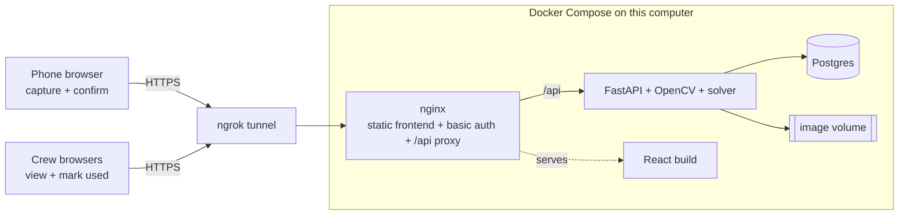
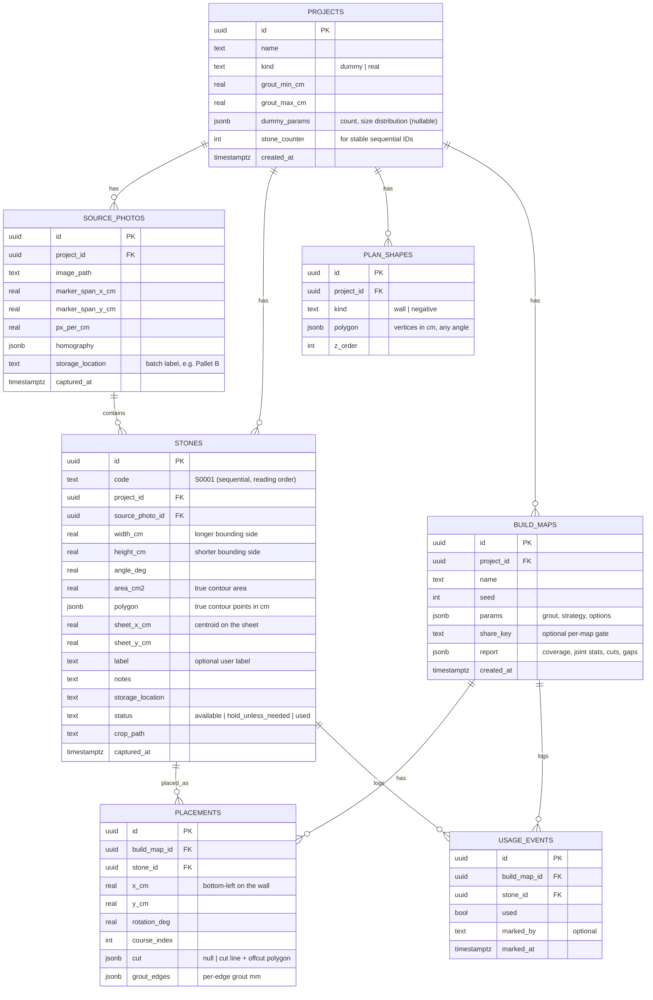
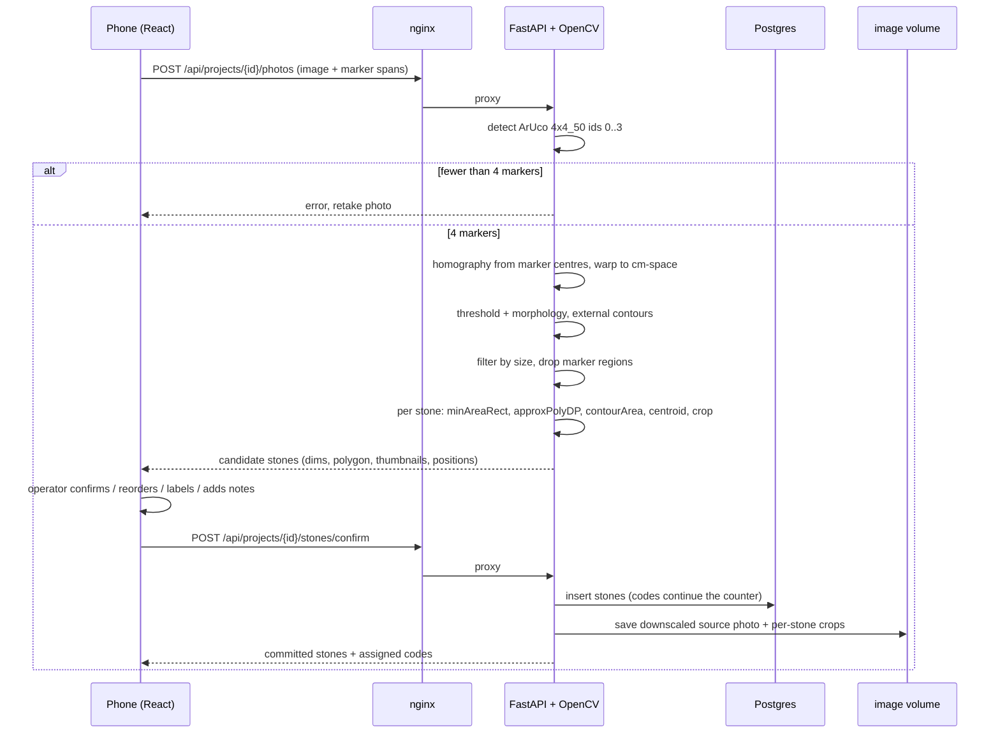
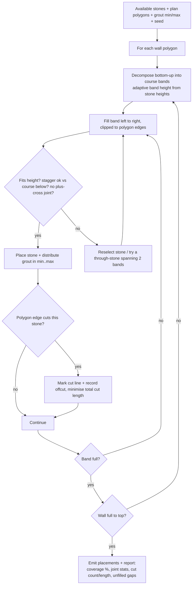
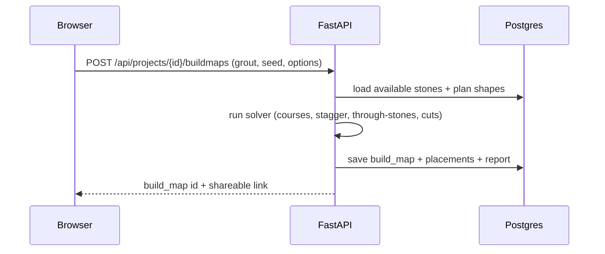
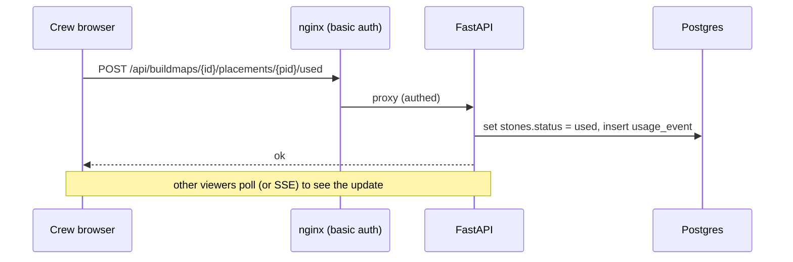
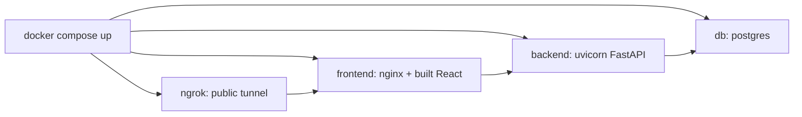

# Architecture , Sandstone Wall Builder

Status: design agreed, pre-build. Dated 05 Jul 2026.
This document is the single source of truth for the tech stack, data model, flows,
and deployment. The earlier spec docs (`00_README`, `01_stone_cataloguer`,
`02_wall_layout_solver`) remain the domain-logic reference; this doc supersedes
their delivery assumptions (they described two Python CLIs; the delivery is one web
app with a server backend).

---

## 1. What this system is

A web app for cataloguing sandstone blocks from overhead photos and designing a
rustic random stone wall from them. It runs as a normal three-tier web app on this
computer, exposed to a phone and to a build crew over the internet via an ngrok
tunnel. Photos are captured on a phone; all heavy processing (computer vision,
packing solver) runs server-side on this computer.

Two problem domains, one app:
1. **Cataloguer** , photo in, measured + cropped + stored stones out.
2. **Wall Layout Solver** , stones + drawn walls in, a build map out.

Target wall face: 270 x 1200 cm (single 2D leaf), stones 10 to 40 cm per side,
mostly around 13 x 30 cm, roughly 100 to 150 stones total. Stones are near
rectangular but NOT perfect rectangles, so true contour shape is captured, not just
width x height.

---

## 2. Key decisions (and why)

| Decision | Choice | Why |
|---|---|---|
| Delivery shape | One web app, server backend | Anonymous "mark used" writes are trivial with a real server; static hosting made them painful |
| Dev hosting | Docker Compose on this computer + ngrok | No cloud cost, full control, shareable URL for the crew; prod deferred |
| Compute location | Server-side (this computer) | Stronger than a phone; lets CV use real Python OpenCV, not the weaker OpenCV.js |
| Frontend | React + Konva + Vite (TypeScript) | Big ecosystem; Konva gives pan/zoom/touch canvas with draggable shapes + hit-testing |
| Backend | FastAPI (Python) | One container/language for both the REST API and the OpenCV pipeline |
| CV | OpenCV (Python) + ArUco DICT_4X4_50 | Matches the printed marker sheet (ids 0 to 3, 150 mm squares); accurate flat measurement |
| Database | Postgres | Concurrency-safe for the crew marking stones used simultaneously |
| Image storage | Docker volume (files on disk) | Simple; DB stores paths, not blobs |
| Access control | Basic auth at the nginx layer | Gates the whole site for the crew; independent of ngrok plan tier |
| Source control | GitHub (`Perpaterb/stone-wall`) | Code only; not used as a data backend |
| Solver v1 | Bounding-box packing, true-shape render | True irregular-polygon nesting is a later refinement |
| Aesthetics | Courses + stagger + through-stones + minimal cuts | Rustic random look, not a brick grid |
| Production | Deferred | Same compose ports to a VPS / Fly.io / Railway later |

---

## 3. Tech stack (what each piece does)

| Layer | Technology | Responsibility |
|---|---|---|
| Client UI | React + TypeScript + Vite | Screens, routing, state, forms |
| Canvas | Konva.js | The Plan editor and Build Map: pan, zoom, touch, draggable/hit-testable shapes |
| API + logic | FastAPI (Python) + Uvicorn | REST endpoints, request validation (Pydantic), orchestration |
| Computer vision | OpenCV (opencv-contrib-python) + NumPy | ArUco detect, homography/warp, threshold, contours, measure, crop |
| Solver | Pure Python module | Course packing, stagger, through-stones, grout, cut minimisation |
| Rendering (server) | Pillow / SVG | Optional server-rendered crops and map export |
| Database | Postgres + SQLAlchemy | Projects, stones, plan shapes, build maps, placements, usage log |
| Image store | Docker volume | Source photos (downscaled) and per-stone crops on disk |
| Web server / gate | nginx | Serves the built frontend, basic-auth gate, proxies `/api` to FastAPI |
| Tunnel | ngrok | Public HTTPS URL to share with the crew |
| Orchestration | Docker Compose | One command brings up db + backend + frontend + tunnel |

---

## 4. System diagram



Single origin: nginx serves the frontend and proxies `/api/*` to FastAPI, so the
browser talks to one host (no CORS headaches). ngrok points at nginx only.

---

## 5. Data model



Notes:
- **Sequential IDs** (`code` = `S0001`...) are assigned left to right, top to bottom
  per photo, continuing `projects.stone_counter` so new photos never reset or
  collide. The operator confirms/reorders before commit.
- **Used state is authoritative on `stones.status`** (a physically used stone is
  gone, so it is excluded from every future solve). `USAGE_EVENTS` is the audit log
  of who marked what and when, per build map.
- **Dummy vs real stones** share the STONES table (kind lives on the project);
  the solver reads stones through one interface and does not care about the source.

---

## 6. Computer-vision pipeline (Cataloguer)



Assumptions carried from the spec: stones laid non-touching on a contrasting sheet,
four markers inside the frame, marker span measured and entered per rig. Touching
stones (needing watershed) are out of scope for v1.

---

## 7. Wall Layout Solver



Design points:
- **v1 packs by bounding boxes** but renders true polygon shapes. True irregular
  nesting is a later refinement pass.
- **Selection strategy is pluggable** so packing heuristics can be tuned.
- **Sloped / angled wall edges force cuts.** The solver flags each cut and reports
  total cut length so we can tune to minimise it.
- **Disconnected walls** draw from one shared stone pool (so the same stone is never
  double-allocated across walls).
- Built and tuned first against a **seedable dummy generator** (near-rectangular
  stones with jittered corners matching the size distribution), before real stones
  exist.

---

## 8. User flows mapped to screens and API

The 10-step workflow, each step mapped to a screen and the calls behind it.

| # | Step | Screen | Key API |
|---|---|---|---|
| 1 | Create project (dummy or real; grout, dummy params) | Projects / New | `POST /api/projects` |
| 2 | Setup photo + ArUco calibration (measure spans) | Setup | `POST /api/projects/{id}/calibrate` |
| 3 | Add stones: photo, detect, confirm each, label, notes | Add Stones | `POST /api/projects/{id}/photos`, `POST .../stones/confirm` |
| 4 | Generate wall map (any time) | Plan → Generate | `POST /api/projects/{id}/buildmaps` |
| 5 | Browse stone DB (detail, delete, hold, source photo, notes) | Stones | `GET/PATCH/DELETE /api/stones/{id}` |
| 6 | The Plan (pan/zoom blueprint) | Plan (main) | `GET /api/projects/{id}/plan` |
| 7 | Draw/edit walls, negatives, disconnected walls | Plan | `PUT /api/projects/{id}/plan` |
| 8 | Grout min/max + coverage vs wall area readout | Plan panel | `GET /api/projects/{id}/coverage` |
| 9 | Create/regenerate/delete build maps (each its own link) | Plan | `POST/DELETE /api/buildmaps/{id}` |
| 10 | Build Map view (mark used, per-edge grout, source highlight) | Build Map | `GET /api/buildmaps/{id}`, `POST .../placements/{pid}/used` |

Two representative sequences:

**Generate a build map**



**Mark a stone used (crew, shared link)**



---

## 9. Frontend structure

```
frontend/src/
  routes/           hash or path routes for the screens in section 8
  views/
    ProjectsView, SetupView, AddStonesView, StonesView,
    PlanView (Konva), BuildMapView (Konva)
  canvas/           Konva helpers: viewport (pan/zoom), shape drawing, hit-testing
  api/              typed client for the FastAPI endpoints
  state/            project/stone/plan/build-map stores
  components/       panels, forms, stone cards, grout controls
```

## 10. Backend structure

```
backend/app/
  main.py           FastAPI app + routers
  api/              route modules: projects, photos, stones, plan, buildmaps
  cv/               aruco, homography, segment, measure, crop
  solver/           source interface, dummy generator, packer, stagger, cuts, report
  db/               SQLAlchemy models + session
  storage/          image volume read/write, downscaling
  schemas/          Pydantic request/response models
```

The `solver/` source interface is the swap point: `DummySource` now, `DbSource`
(reads STONES) later, with zero change to the packing code.

---

## 11. Deployment (dev)



Compose services:
- **db** , Postgres, named volume for data.
- **backend** , FastAPI/Uvicorn, mounts the image volume, connects to db.
- **frontend** , nginx serving the Vite build, basic-auth (htpasswd) on all routes,
  proxying `/api` to backend.
- **ngrok** , tunnels to the frontend container, giving a public HTTPS URL.

During active development, the Vite dev server can run on the host for hot reload;
the nginx + ngrok path is for sharing a running build with the crew.

Access: the whole site sits behind nginx basic auth. Sharing a build map = sharing
the URL plus the site password. Per build-map `share_key` gating is available if a
map ever needs to be shared more narrowly, but is optional under the site password.

---

## 12. Production (deferred)

Not built now. When needed, the same Compose stack deploys to a small VPS or a
platform like Fly.io / Railway with a managed Postgres and a stable domain (instead
of ngrok's ephemeral URL). Revisit auth (real accounts) and image storage (object
store) at that point.

---

## 13. Build milestones

| Milestone | Delivers |
|---|---|
| **M0** Scaffold | Docker Compose (db, backend, nginx, ngrok), FastAPI health, React shell, Postgres migrations, basic auth, one project create/list round trip |
| **M1** The Plan | Konva pan/zoom editor: draw/edit walls + negatives + disconnected walls, grout min/max, live coverage vs wall-area |
| **M2** Solver v1 (dummy) | Dummy generator + packer (courses, stagger, through-stones, grout, cuts) + report + Build Map render + shareable link. Aesthetic-tuning milestone |
| **M3** Cataloguer | OpenCV pipeline, calibration, photo→detect→confirm→commit (crops + source), sequential IDs, Stone DB browser. Swap DummySource → DbSource |
| **M4** Build Map polish | Mark used → DB, per-edge grout, source-photo highlight, regenerate/delete maps, hold-unless-needed |
| **M5** Hardening | Measurement accuracy vs hand-measured, error handling, image-store hygiene, prod path spike |

---

## 14. Open items to confirm during build

- Exact marker span for the working rig (measured per setup; default 100 x 100 cm).
- Phone camera resolution (drives achievable mm accuracy; target 2 to 3 mm).
- Whether stones ever touch in a photo (v1 requires gaps; watershed is out of scope).
- Realtime update mechanism for "mark used" (simple polling first, SSE if needed).
</content>
</invoke>
